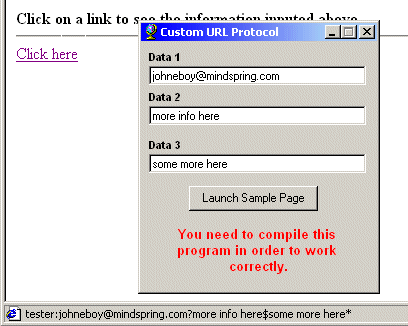



## Custom URL Protocol Maker 2

### Description

This is in response to a comment i got on my last custom protocol maker app. This one pass's variables to your program. this example shows how to get 3 seperate pieces of into from a URL click.

you can add more, or less. if you want to see more of how to make a custom protocol, you can check out http://www.planet-source-code.com/vb/scripts/ShowCode.asp?txtCodeId=34097&lngWId=1
 
### More Info
 

             |
---                |---
**Submitted On**   |2002-07-29 04:42:46
**By**             |[Johneboy](https://github.com/Planet-Source-Code/PSCIndex/blob/master/ByAuthor/johneboy.md)
**Level**          |Beginner
**User Rating**    |5.0 (10 globes from 2 users)
**Compatibility**  |VB 6\.0
**Category**       |[Internet/ HTML](https://github.com/Planet-Source-Code/PSCIndex/blob/master/ByCategory/internet-html__1-34.md)
**World**          |[Visual Basic](https://github.com/Planet-Source-Code/PSCIndex/blob/master/ByWorld/visual-basic.md)
**Archive File**   |[Custom\_URL1119157292002\.zip](https://github.com/Planet-Source-Code/johneboy-custom-url-protocol-maker-2__1-37352/archive/master.zip)

